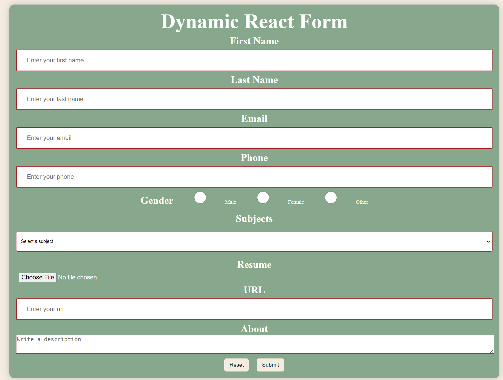
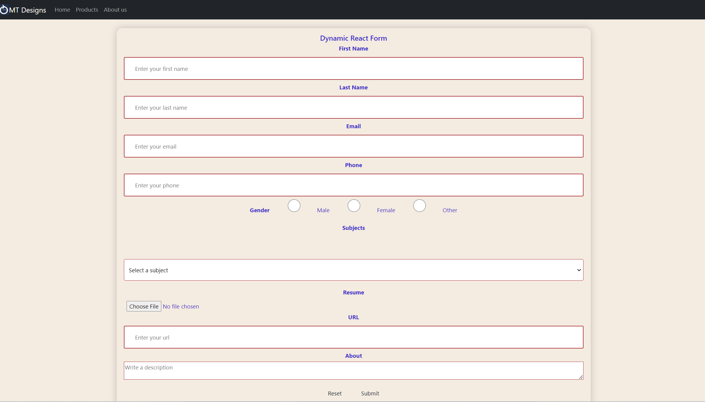

# React Dynamic Form Builder
## Description 
A comprehensive form-building application in React JS, covering everything from basic text fields to advanced elements like dropdowns, email fields, description areas, and file uploads. This project includes implementation details for reset and submit buttons to ensure full form functionality.
Table of Contents
- [React Dynamic Form Builder](#react-dynamic-form-builder)
  - [Description](#description)
  - [Features](#features)
  - [Getting Started](#getting-started)
  - [Prerequisites](#prerequisites)
  - [Installation](#installation)
  - [Usage](#usage)
  - [Components](#components)
  - [Contributing](#contributing)
  - [Credits](#credits)
  - [License](#license)

## Features
Dropdown menus
Email fields
Description areas (textarea)
File uploads
Reset and Submit buttons
Dynamic form generation

## Getting Started
These instructions will help you set up and run the project on your local machine.

## Prerequisites
Node.js (>= 14.x)
npm (>= 6.x) or yarn (>= 1.x)

## Installation
Clone the repository:
bash

git clone https://github.com/yourusername/react-dynamic-form-builder.git
Navigate to the project directory:
bash

cd react-dynamic-form-builder
Install the dependencies:
Using npm:

bash

npm install
Using yarn:

bash

yarn install

Start the development server:

Using npm:

bash

npm start
Using yarn:

bash

yarn start
Open your browser and navigate to http://localhost:3000 to see the application in action.

## Usage
This application provides a dynamic form builder. You can add various form elements such as text fields, dropdowns, email fields, description areas, and file uploads. The form includes reset and submit functionality to manage form state effectively.

The screenshot for the app is found here:

And with some bootsrap:

## Components
TextField: A basic input field for text.
Dropdown: A select element for choosing options.
EmailField: An input field for email addresses.
DescriptionArea: A textarea for longer text input.
FileUpload: An input field for file uploads.
Form: The main form component that integrates all elements.
FormButtons: Reset and Submit buttons to handle form actions.
Example
Here’s a basic example of how to use the components:

jsx

import React from 'react';
import { TextField, Dropdown, EmailField, DescriptionArea, FileUpload, FormButtons } from './components';

const App = () => {
  return (
    

      <h1>Dynamic Form</h1>
      <form>
        <TextField label="Name" name="name" />
        <EmailField label="Email" name="email" />
        <DescriptionArea label="Description" name="description" />
        <Dropdown label="Options" name="options" options={['Option 1', 'Option 2', 'Option 3']} />
        <FileUpload label="Upload File" name="file" />
        <FormButtons />
      </form>
    

  );
}

export default App;

## Contributing
Contributions are welcome! Please open an issue or submit a pull request for any improvements or new features.

Steps to Contribute
Fork the repository.
Create a new branch (git checkout -b feature-branch).
Make your changes.
Commit your changes (git commit -m 'Add some feature').
Push to the branch (git push origin feature-branch).
Open a pull request.

## Credits
This project is based on a tutorial by Web Dev Simplified. Special thanks for the detailed guide on building dynamic forms in React.

## License
This project is licensed under the MIT License. See the LICENSE file for details.

By following this README, you'll be able to set up, run, and contribute to the React Dynamic Form Builder project efficiently. Happy coding!

Currently, two official plugins are available:

- [@vitejs/plugin-react](https://github.com/vitejs/vite-plugin-react/blob/main/packages/plugin-react/README.md) uses [Babel](https://babeljs.io/) for Fast Refresh
- [@vitejs/plugin-react-swc](https://github.com/vitejs/vite-plugin-react-swc) uses [SWC](https://swc.rs/) for Fast Refresh
